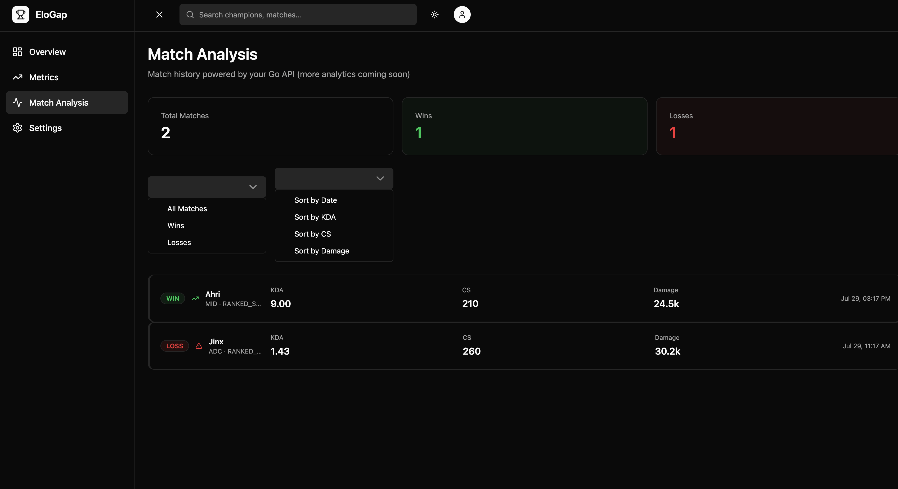

# Elogap

An open, read-only web portal for League of Legends competitive data. Search a player,
see analytics on their matches — with Strava-style personalized **streaks** (win streaks,
KDA streaks, CS/min progressions) as the differentiator.

The design philosophy is minimalism and precision, in contrast to the density of tools
like OP.gg: show what matters, hide the noise. No login, no accounts — not a social
platform.

<!-- Add a screenshot here, e.g.:  -->

## Tech Stack

**Backend (`api/`)**
- Go + Gin
- Clean architecture (handlers → services → repository, dependencies pointing inward)
- In-memory repository (baseline — see Project Status)

**Frontend (`ui/`)**
- SvelteKit + Svelte 5 (runes)
- TypeScript · Tailwind · shadcn-svelte
- pnpm

**Tooling**
- Docker Compose · `air` (Go live reload)

## Architecture

Monorepo with a Go backend in `api/` and a SvelteKit frontend in `ui/`, talking over a
JSON HTTP API. The backend follows clean architecture: each layer has one
responsibility, dependencies point inward toward a pure domain core, and wiring is done
with explicit manual dependency injection in `router.go` — no framework, no global state.
The repository layer sits behind interfaces so the data source can evolve without
touching services or handlers.

## Running Locally

    # full stack
    docker compose up --build

    # backend only (api/)          # frontend only (ui/)
    go run ./cmd/api               pnpm install
                                   pnpm dev

Environment variables are read from a `.env` file in the project root; check the
`docker-compose.yml` and the config in `api/` for the current set.

## Project Status

Early-stage, learning-focused project. `main` runs on an **in-memory repository** —
match data is seeded in memory and resets on restart; there is no live data source or
database yet. The frontend is scaffolded (navigation, match-analysis views, filters and
sorting) and consumes the API, with several views awaiting real data.

## Active Development

An open **draft pull request** (`feature/riot-integration`) is building the foundation
for real data, ahead of integrating the Riot Games API as the live source:

- **Persistence layer** — PostgreSQL + GORM, with schema created via AutoMigrate.
- **Clean record/domain separation** — persistence structs (GORM tags, DB columns) live
  in their own layer and map to/from the domain; the domain core stays free of any
  persistence concern.
- **Postgres repositories** — summoner and activity repositories with upsert semantics,
  laying the groundwork for a cache-aside flow that respects the Riot API's rate limits.

The PR is scoped to the persistence work that is done, with Riot integration noted as the
next step. It's kept as a draft while that work continues.

## Note

Elogap is a personal, learning-oriented project; its scope is deliberately bounded and it
is not intended for public deployment. Not affiliated with or endorsed by Riot Games.